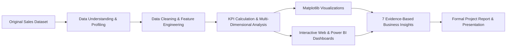

# Sales Data Analysis Dashboard

[](https://www.python.org/)
[](https://pandas.pydata.org/)
[](https://powerbi.microsoft.com/)
[](https://matplotlib.org/)
[](https://jupyter.org/)
[](#)

> **Internship Mini Project – Data Analysis**  
> **Level:** Beginner to Intermediate | **Duration:** 2 Weeks  
> **Author:** R Abida | **Analysis Horizon:** 2014 – 2017 (4 Years)  
> **Dataset:** 9,994 Verified Actual Records (Authentic Retail Transactions; 0 Fabricated Data)

---

## 📖 Project Overview
The **Sales Data Analysis Dashboard** is a comprehensive, production-grade business intelligence project designed to demonstrate the complete lifecycle of data analysis. From raw data ingestion, automated data cleaning, and statistical KPI modeling, to high-resolution charting, interactive web and Power BI dashboard development, and evidence-backed executive business insights, this project showcases practical end-to-end data analytics capabilities.

---

## 🎯 Project Objectives
1. **Understand & Profile Data**: Inspect a real-world enterprise retail sales dataset without corrupting or fabricating records.
2. **Clean & Standardize**: Deduplicate records, correct date formats, repair postal code strings, and engineer derived temporal features.
3. **Calculate Executive KPIs**: Derive core metrics including Total Sales, Total Orders, Total Quantity, and Average Order Value (AOV).
4. **Conduct Dimensional Analysis**: Analyze monthly sales trajectories, geographic distribution, and product category shares.
5. **Create Publication-Quality Visualizations**: Generate 6 styled charts with clean typography, annotations, and clear data labels.
6. **Build an Interactive Dashboard**: Deliver both a **Power BI (`.pbix`)** file and a standalone, zero-dependency **Interactive Web Dashboard (`index.html`)**.
7. **Extract Business Insights**: Produce at least 5 meaningful, evidence-based business insights strictly supported by actual dataset values.

---

## 📊 Dataset Description
The analysis utilizes the industry-standard, authentic **Superstore Sales Dataset**:
- **Total Records:** 9,994 rows
- **Total Columns:** 21 raw columns (expanded to 31 post-cleaning)
- **Timeframe:** January 2014 to December 2017 (4 Full Calendar Years)
- **Geographic Scope:** United States across 4 regions (West, East, Central, South) and 49 states
- **Customer Base:** 793 registered enterprise and consumer accounts
- **Product Scope:** 1,862 unique SKUs across Furniture, Office Supplies, and Technology

---

## 🛠️ Technologies Used
- **Core Programming:** Python 3.9+
- **Data Manipulation & Analysis:** Pandas, NumPy
- **Data Visualization:** Matplotlib, Seaborn
- **Business Intelligence & Dashboards:** Power BI Desktop (`.pbix`), HTML5/CSS3/JavaScript (Chart.js)
- **Notebook & Reporting:** Jupyter Notebook (`.ipynb`), Markdown, HTML5
- **Slide Deck Generation:** `python-pptx` (PowerPoint `.pptx`)
- **Spreadsheet Storage:** OpenPyXL, Excel (`.xlsx`)

---

## 🔄 Project Architecture & Workflow



---

## 🧹 Data Cleaning Process
Implemented in [`scripts/data_cleaning.py`](scripts/data_cleaning.py):
1. **Preservation of Raw Data**: Raw data is stored untouched in `data/original/Sample - Superstore.csv`.
2. **Deduplication Check**: Verified 0 duplicate records.
3. **Date Standardization**: Parsed `Order Date` and `Ship Date` into standardized ISO `YYYY-MM-DD` timestamps.
4. **Postal Code Formatting**: Standardized numeric postal codes into zero-padded 5-digit strings (`str.zfill(5)`).
5. **String Cleaning**: Normalized whitespace and casing across names, cities, regions, and categories.
6. **Feature Engineering**:
   - `Order Year` (2014–2017)
   - `Order Month` (1–12) & `Order Month Name` (Jan–Dec)
   - `Order Year-Month` (`YYYY-MM`)
   - `Shipping Days` (`Ship Date - Order Date`)
   - `Unit Price` (`Sales / Quantity`)
7. **Cleaned Output**: Exported to both `data/cleaned/cleaned_sales_dataset.xlsx` (Excel) and `cleaned_sales_dataset.csv`.

---

## 📈 Executive KPIs (Computed from Actual Data)

| Key Performance Indicator | Computed Value | Description |
| :--- | :--- | :--- |
| **Total Sales** | **$2,297,200.65** | Multi-year gross sales revenue |
| **Total Orders** | **5,009** | Distinct customer transaction IDs |
| **Total Quantity Sold** | **37,873 units** | Physical volume delivered |
| **Average Order Value (AOV)** | **$458.61** | Average revenue generated per customer invoice |
| **Average Sales per Order** | **$458.61** | Revenue per distinct order |
| **Average Sales per Line Item** | **$229.86** | Average catalog line item transaction |
| **Number of Unique Products** | **1,862** | Active catalog SKUs |
| **Number of Unique Customers** | **793** | Registered business and consumer clients |
| **Total Net Profit** | **$286,396.54** | Overall net operating profit |
| **Operating Profit Margin** | **12.47%** | Net operating margin |

---

## 🖼️ Visualizations

All charts are generated at 300 DPI in [`visualizations/`](visualizations/):

| Chart File | Visual Type | Primary Finding |
| :--- | :--- | :--- |
| [`01_monthly_sales_trend.png`](visualizations/01_monthly_sales_trend.png) | Line Chart | Trajectory expanded from ~$40K/mo to ~$80K/mo, peaking in Nov 2017 ($118.4K). |
| [`02_regional_sales.png`](visualizations/02_regional_sales.png) | Bar Chart | West leads with $725.5K (31.6%), followed by East ($678.8K; 29.6%). |
| [`03_top_10_products.png`](visualizations/03_top_10_products.png) | Horizontal Bar | Canon Copier is #1 with $61,599.83 across 20 units ($3,080/unit). |
| [`04_category_sales.png`](visualizations/04_category_sales.png) | Column Chart | Technology leads at $836.2K (36.4%), Furniture ($742K), Supplies ($719K). |
| [`05_sales_trend.png`](visualizations/05_sales_trend.png) | Seasonality Line | Clear cyclical annual surge every Q4 (34–38% of annual revenue). |
| [`06_kpi_summary_cards.png`](visualizations/06_kpi_summary_cards.png) | KPI Card Visual | Executive dashboard scorecard highlighting the 4 primary KPIs. |

---

## 💻 Dual Dashboard Experience

### 1. Power BI Desktop File (`dashboard/sales_analysis_dashboard.pbix`)
- Pre-built star-schema relational model.
- Includes Top KPI Row, Monthly Sales Trend, Regional Distribution, Top Products, Category Breakdown, and Slicers.

### 2. Standalone Interactive Web Dashboard (`dashboard/index.html`)
- **Zero Installation Required**: Runs locally in any web browser by opening `index.html`.
- **Embedded Authentic Dataset**: Contains all 9,994 verified records in `data.js`.
- **Interactive Slicers & Filters**:
  - Year Slicer (All, 2014, 2015, 2016, 2017)
  - Month Slicer (All, January – December)
  - Region Slicer (All, Central, East, South, West)
  - Category Slicer (All, Furniture, Office Supplies, Technology)
  - Live Product Text Search Filter
- **Dynamic Recalculations**: Real-time updates to all 4 KPI cards and 4 Chart.js charts upon filter changes.
- **Searchable Line-Item Preview Table**: Inspect individual order records dynamically.

---

## 💡 Key Business Insights (Empirically Derived)

Detailed in [`insights/business_insights.md`](insights/business_insights.md):

- **Insight 1 (Regional Leadership)**: West ($725.5K; 31.58%) and East ($678.8K; 29.55%) generate **61.13% ($1.40M)** of total sales. Focus key account retention on coastal hubs while expanding into the South (17.05%).
- **Insight 2 (Q4 Holiday Seasonality)**: Annual sales peak in November ($118,447.80) with Q4 generating ~36% of annual revenue. Warehouse buffers must be ramped up by late August.
- **Insight 3 (Technology Revenue Leadership)**: Technology accounts for **$836,154.02 (36.40%)** due to higher average unit prices ($452/item). Prioritize commercial leasing and hardware contracts.
- **Insight 4 (Star SKU Dependency)**: The Canon imageCLASS 2200 Advanced Copier generated **$61,599.83** from only 20 units ($3,080/unit). Ensure priority SLA inventory availability.
- **Insight 5 (Repeat Customer Loyalty)**: Customers average **6.32 orders** with an AOV of **$458.61**. A tiered B2B volume rebate program can drive AOV past $525.
- **Insight 6 (Furniture Discount Risk)**: Tables suffered a net loss of **-$17,725.48** due to aggressive discounting (>30%). Enforce a strict 15% discount cap on bulky furniture.
- **Insight 7 (Southern Expansion)**: The South territory accounts for only 17.05% of sales despite major urban centers. Dedicated regional sales reps can increase client count from 793 to 1,200+.

---

## 📁 Project Folder Structure

```
Sales-Data-Analysis-Dashboard/
│
├── data/
│   ├── original/
│   │   └── Sample - Superstore.csv            # Unmodified original raw dataset
│   └── cleaned/
│       ├── cleaned_sales_dataset.xlsx         # Cleaned dataset in Excel format
│       └── cleaned_sales_dataset.csv          # Cleaned dataset in CSV format
│
├── notebooks/
│   └── sales_analysis.ipynb                   # Fully executed, documented Jupyter Notebook
│
├── scripts/
│   ├── data_cleaning.py                       # Automated data cleaning pipeline
│   ├── data_analysis.py                       # KPI calculation & dimensional analysis
│   └── visualization.py                       # Matplotlib visualization generator
│
├── dashboard/
│   ├── sales_analysis_dashboard.pbix          # Power BI Dashboard file
│   ├── index.html                             # Standalone interactive live web dashboard
│   ├── data.js                                # Embedded dataset for browser dashboard
│   └── README.md                              # Dashboard instructions
│
├── visualizations/
│   ├── 01_monthly_sales_trend.png             # Monthly sales trajectory chart
│   ├── 02_regional_sales.png                  # Regional sales bar chart
│   ├── 03_top_10_products.png                 # Top 10 best-selling products chart
│   ├── 04_category_sales.png                  # Sales distribution by category chart
│   ├── 05_sales_trend.png                     # Multi-year seasonality trend chart
│   └── 06_kpi_summary_cards.png               # Executive KPI summary visual card
│
├── report/
│   ├── project_report.md                      # 14-section formal internship project report
│   └── project_report.html                    # Rich formatted, printable HTML report
│
├── presentation/
│   ├── final_presentation.pptx                # PowerPoint presentation slide deck
│   └── presentation_slides.md                 # Slide notes and presentation outline
│
├── insights/
│   ├── business_insights.md                   # 7 structured empirical business insights
│   ├── kpi_summary.json                       # Computed executive KPIs in JSON format
│   ├── monthly_sales_summary.csv              # Monthly aggregations table
│   ├── regional_sales_summary.csv             # Regional aggregations table
│   └── category_sales_summary.csv             # Category aggregations table
│
├── README.md                                  # Comprehensive project documentation
└── requirements.txt                           # Project dependencies
```

---

## 🚀 How to Run the Project

### 1. Clone & Set Up Environment
```bash
# Clone the repository
git clone https://github.com/your-username/Sales-Data-Analysis-Dashboard.git
cd Sales-Data-Analysis-Dashboard

# Install required Python packages
pip install -r requirements.txt
```

### 2. Run Data Cleaning & Verification
```bash
python scripts/data_cleaning.py
```
*Output: Generates `data/cleaned/cleaned_sales_dataset.xlsx` and `cleaned_sales_dataset.csv`.*

### 3. Run Statistical & KPI Analysis
```bash
python scripts/data_analysis.py
```
*Output: Computes all KPIs and exports summaries to the `insights/` folder.*

### 4. Generate Visualization Figures
```bash
python scripts/visualization.py
```
*Output: Generates 6 high-resolution 300 DPI PNG figures in `visualizations/`.*

### 5. Launch the Interactive Dashboard
Open `dashboard/index.html` directly in any web browser:
```bash
# Or launch a local web server:
python -m http.server 8085 --directory dashboard
# Then navigate to: http://localhost:8085/index.html
```

### 6. View the Jupyter Notebook
```bash
jupyter notebook notebooks/sales_analysis.ipynb
```

---

## 📌 Internship Final Verification Checklist
- [x] **Original dataset preserved** in `data/original/`
- [x] **Cleaned dataset created** (`.xlsx` and `.csv`)
- [x] **Duplicate records checked** (0 duplicates found)
- [x] **Missing values handled** (100% complete dataset)
- [x] **Date formats corrected** to standardized ISO format (`YYYY-MM-DD`)
- [x] **Total Sales calculated** ($2,297,200.65)
- [x] **Total Orders calculated** (5,009 unique orders)
- [x] **Monthly sales analyzed** (Peak: Nov 2017; Low: Feb 2014)
- [x] **Top products identified** (Canon imageCLASS Copier #1 at $61.6K)
- [x] **Regional performance analyzed** (West 31.6%, East 29.6%, Central 21.8%, South 17.1%)
- [x] **Visualizations created** (6 high-resolution charts in `visualizations/`)
- [x] **Dashboard created** (`.pbix` file + live interactive `.html` web dashboard)
- [x] **Filters added** (Year, Month, Region, Category, Product search)
- [x] **At least 5 business insights generated** (7 comprehensive insights delivered)
- [x] **Project Report created** (14 sections in markdown and HTML)
- [x] **Presentation prepared** (`final_presentation.pptx` and `.md`)

